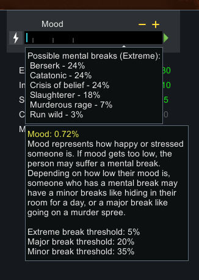
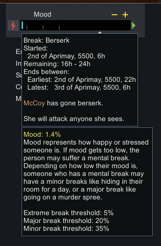
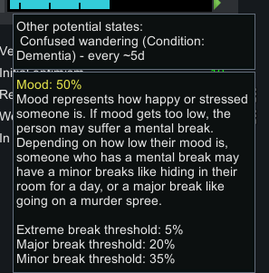
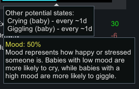

# Break Timer

A RimWorld mod that shows how long is remaining on a pawn's mental break and lists the mental breaks possible for any given pawn.

## Examples

Mood Breaks Possible

Mid-Break

Breaks from Hediffs

Breaks from pawn state (baby!)

## Supported versions

- RimWorld 1.6

## Dependencies

- [Harmony](https://steamcommunity.com/sharedfiles/filedetails/?id=2009463077)
